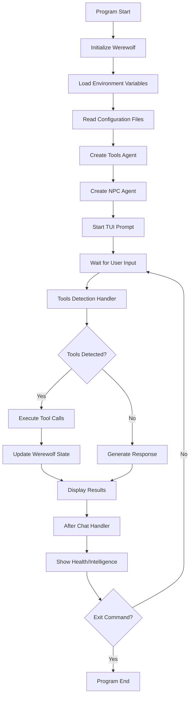
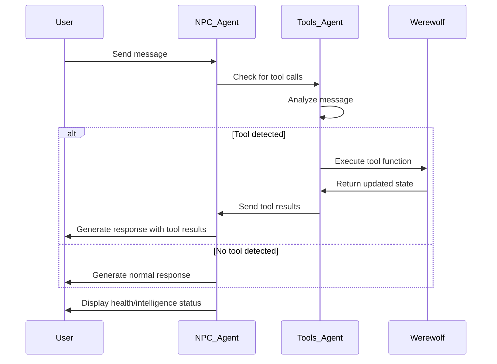
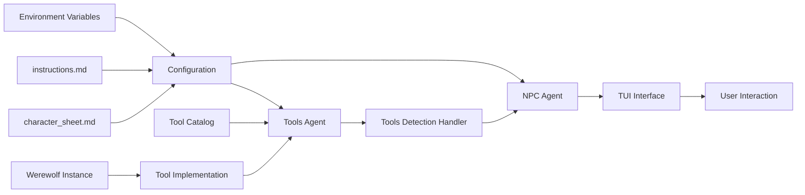

# Main.go Analysis

## Overview
This Go program implements a conversational AI agent system representing a werewolf character with tool capabilities. The program uses the budgie agents framework to create an interactive chat experience where users can query and modify werewolf attributes through natural language.

## Key Components

### 1. Werewolf Structure
```go
type Werewolf struct {
    Health       float64
    Strength     float64
    Agility      float64
    Intelligence float64
}
```
- Represents the werewolf character with four attributes
- Initial values: Health=100, Strength=80, Agility=70, Intelligence=60

### 2. Environment Configuration
- `MODEL_RUNNER_BASE_URL`: Base URL for the AI model runner
- `MODEL_RUNNER_MODEL`: Specifies which AI model to use
- Both environment variables are required and will cause panic if not set

### 3. Agent Architecture
The program implements a dual-agent system:

#### Tools Agent (`tools_agent`)
- Dedicated to detecting and executing tool calls
- Uses temperature 0.0 for consistent tool detection
- Parallel tool calls disabled for sequential execution
- Handles 8 different tools for werewolf attribute management

#### NPC Agent (`npc_agent`)
- Main conversational agent representing the werewolf
- Uses temperature 0.5 for more natural conversation
- Loads character sheet and system instructions
- Integrates with tools agent through event handlers

### 4. Tool Catalog
The program provides 8 tools for werewolf attribute management:

**Health Management:**
- `get_health`: Retrieve current health value
- `set_health`: Set health to specific value
- `increase_health`: Add to current health
- `decrease_health`: Subtract from current health

**Intelligence Management:**
- `get_intelligence`: Retrieve current intelligence value
- `set_intelligence`: Set intelligence to specific value
- `increase_intelligence`: Add to current intelligence
- `decrease_intelligence`: Subtract from current intelligence

### 5. Tool Implementation
- Tools are implemented as closures that modify the werewolf instance
- Each tool returns formatted messages for user display
- All tool executions are logged with debug information

### 6. Event Handling
The program uses two main event handlers:

#### Before Chat Completion (`toolsDetectionHandler`)
- Detects tool calls in user messages
- Executes detected tools using the tools agent
- Injects tool results back into the conversation

#### After Chat Completion
- Displays current werewolf health and intelligence status
- Provides visual feedback after each interaction

### 7. User Interface
- Terminal-based chat interface (TUI)
- Streaming completion support
- Custom prompts and messages
- Interrupt handling (Ctrl+C)
- Exit command (`/bye`)

## Program Flow



## Tools Detection and Execution Flow



## Architecture Components



## Key Features

1. **Dual Agent System**: Separates tool detection from conversation generation
2. **State Management**: Maintains werewolf attributes throughout the session
3. **Tool Integration**: Seamlessly integrates function calls with natural language
4. **Interactive UI**: Terminal-based chat with streaming responses
5. **Error Handling**: Comprehensive error handling for missing configurations
6. **Extensible Design**: Easy to add new tools and attributes

## Technical Details

- **Framework**: Uses budgie agents framework for AI agent management
- **AI Model**: OpenAI-compatible API for language model integration
- **Temperature Settings**: 0.0 for tools, 0.5 for conversation
- **Streaming**: Supports real-time response streaming
- **File Dependencies**: Requires `instructions.md` and `character_sheet.md`

## Potential Improvements

1. Add input validation for tool parameters
2. Implement bounds checking for attribute values
3. Add more werewolf attributes (Strength, Agility tools)
4. Implement persistence for werewolf state
5. Add error recovery for failed tool executions
6. Implement tool parameter validation